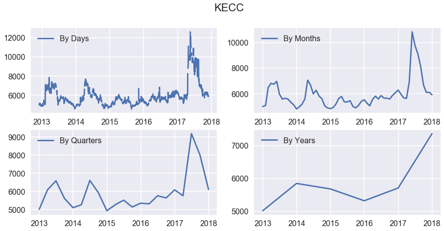
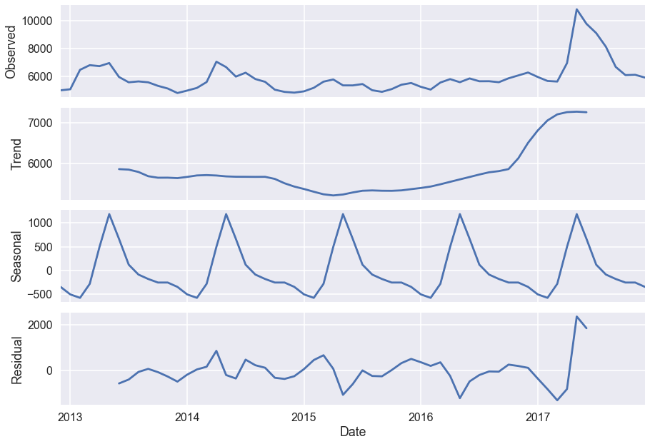
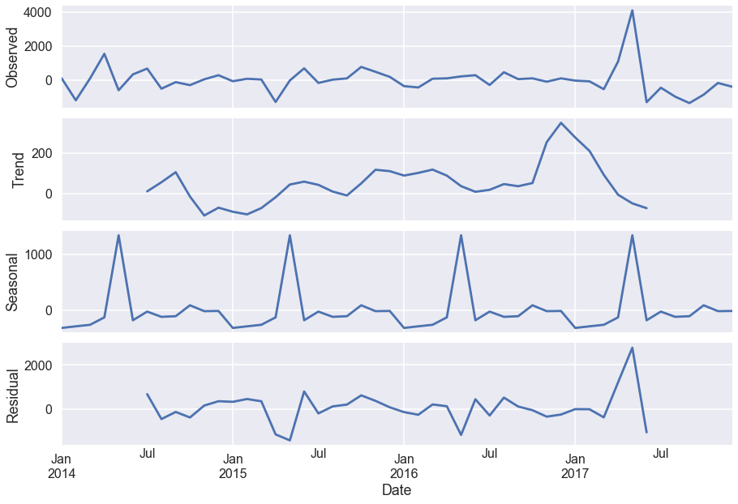
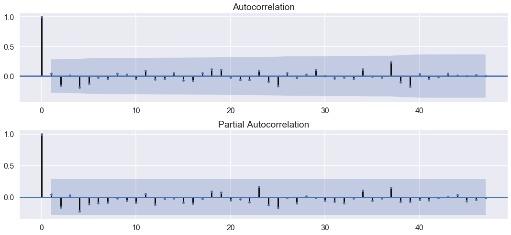
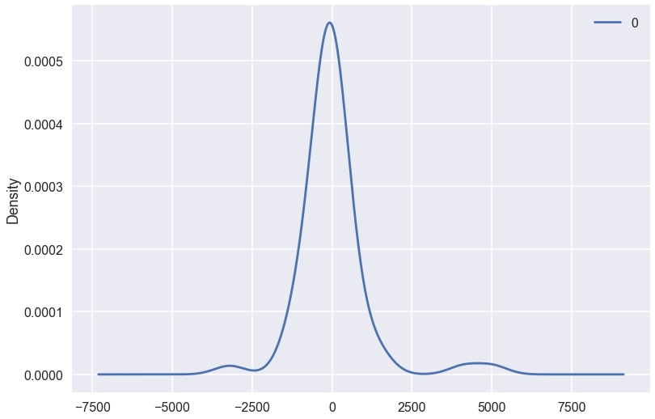
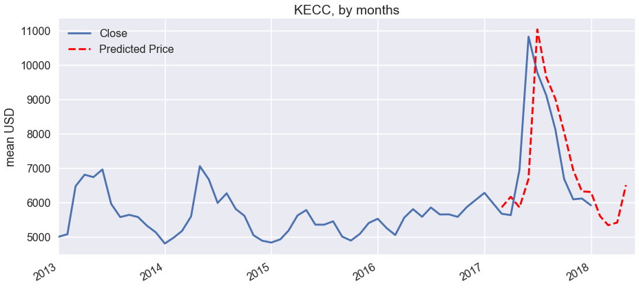

```python
# Import libraries
import numpy as np
import pandas as pd
import seaborn as sns
import matplotlib.pyplot as plt
import matplotlib as mpl
from scipy import stats
import statsmodels.api as sm
import warnings
from itertools import product
from datetime import datetime
warnings.filterwarnings('ignore')
plt.style.use('seaborn-poster')
```

    C:\ProgramData\Anaconda3\lib\site-packages\statsmodels\compat\pandas.py:56: FutureWarning: The pandas.core.datetools module is deprecated and will be removed in a future version. Please use the pandas.tseries module instead.
      from pandas.core import datetools


```python
# Load data
df = pd.read_csv('./kecc.csv')
df.head()
```


<div>
<style>
    .dataframe thead tr:only-child th {
        text-align: right;
    }

    .dataframe thead th {
        text-align: left;
    }

    .dataframe tbody tr th {
        vertical-align: top;
    }
</style>
<table border="1" class="dataframe">
  <thead>
    <tr style="text-align: right;">
      <th></th>
      <th>Date</th>
      <th>Open</th>
      <th>High</th>
      <th>Low</th>
      <th>Close</th>
      <th>Adj Close</th>
      <th>Volume</th>
    </tr>
  </thead>
  <tbody>
    <tr>
      <th>0</th>
      <td>2012-12-03</td>
      <td>5050</td>
      <td>5100</td>
      <td>4925</td>
      <td>5010</td>
      <td>4546.923828</td>
      <td>20660</td>
    </tr>
    <tr>
      <th>1</th>
      <td>2012-12-04</td>
      <td>5000</td>
      <td>5070</td>
      <td>4970</td>
      <td>5020</td>
      <td>4555.999512</td>
      <td>24000</td>
    </tr>
    <tr>
      <th>2</th>
      <td>2012-12-05</td>
      <td>5030</td>
      <td>5160</td>
      <td>4980</td>
      <td>5150</td>
      <td>4673.983887</td>
      <td>27311</td>
    </tr>
    <tr>
      <th>3</th>
      <td>2012-12-06</td>
      <td>5140</td>
      <td>5180</td>
      <td>5040</td>
      <td>5050</td>
      <td>4583.227051</td>
      <td>13000</td>
    </tr>
    <tr>
      <th>4</th>
      <td>2012-12-07</td>
      <td>5100</td>
      <td>5100</td>
      <td>5000</td>
      <td>5010</td>
      <td>4546.923828</td>
      <td>24100</td>
    </tr>
  </tbody>
</table>
</div>


```python
# Unix-time to
df.Timestamp = pd.to_datetime(df.Date)

# Resampling to daily frequency
df.index = df.Timestamp
df = df.resample('D').mean()

# Resampling to monthly frequency
df_month = df.resample('M').mean()

# Resampling to annual frequency
df_year = df.resample('A-DEC').mean()

# Resampling to quarterly frequency
df_Q = df.resample('Q-DEC').mean()
```


```python
fig = plt.figure(figsize=[15, 7])
plt.suptitle('KECC', fontsize=22)

plt.subplot(221)
plt.plot(df.Close, '-', label='By Days')
plt.legend()

plt.subplot(222)
plt.plot(df_month.Close, '-', label='By Months')
plt.legend()

plt.subplot(223)
plt.plot(df_Q.Close, '-', label='By Quarters')
plt.legend()

plt.subplot(224)
plt.plot(df_year.Close, '-', label='By Years')
plt.legend()

# plt.tight_layout()
plt.show()
```





```python
plt.figure(figsize=[15,7])
sm.tsa.seasonal_decompose(df_month.Close).plot()
print("Dickey–Fuller test: p=%f" % sm.tsa.stattools.adfuller(df_month.Close)[1])
plt.show()
```

    Dickey–Fuller test: p=0.010981


    <matplotlib.figure.Figure at 0x26a6c6479e8>





```python
df_month['prices_box_diff'] = df_month.Close - df_month.Close.shift(12)

print("Dickey–Fuller test: p=%f" % sm.tsa.stattools.adfuller(df_month.prices_box_diff[12:])[1])
print(df_month['prices_box_diff'])
```

    Dickey–Fuller test: p=0.134193
    Date
    2012-12-31            NaN
    2013-01-31            NaN
    2013-02-28            NaN
    2013-03-31            NaN
    2013-04-30            NaN
    2013-05-31            NaN
    2013-06-30            NaN
    2013-07-31            NaN
    2013-08-31            NaN
    2013-09-30            NaN
    2013-10-31            NaN
    2013-11-30            NaN
    2013-12-31    -194.555556
    2014-01-31     -94.886364
    2014-02-28   -1299.289474
    2014-03-31   -1211.428571
    2014-04-30     319.090909
    2014-05-31    -291.954887
    2014-06-30      27.368421
    2014-07-31     690.000000
    2014-08-31     170.690476
    2014-09-30      35.292398
    2014-10-31    -275.714286
    2014-11-30    -243.714286
    2014-12-31      27.809524
    2015-01-31     -53.630952
    2015-02-28       8.205882
    2015-03-31      27.337662
    2015-04-30   -1274.090909
    2015-05-31   -1310.029240
                     ...     
    2015-07-31    -813.478261
    2015-08-31    -802.833333
    2015-09-30    -717.986842
    2015-10-31      41.904762
    2015-11-30     514.666667
    2015-12-31     690.714286
    2016-01-31     321.380952
    2016-02-29    -126.928105
    2016-03-31     -61.363636
    2016-04-30      24.863636
    2016-05-31     227.555556
    2016-06-30     499.870130
    2016-07-31     199.068323
    2016-08-31     646.060606
    2016-09-30     688.513158
    2016-10-31     775.119048
    2016-11-30     666.060606
    2016-12-31     752.380952
    2017-01-31     707.000000
    2017-02-28     618.222222
    2017-03-31      69.545455
    2017-04-30    1146.500000
    2017-05-31    5231.421053
    2017-06-30    3917.619048
    2017-07-31    3454.761905
    2017-08-31    2466.363636
    2017-09-30    1099.736842
    2017-10-31     227.794118
    2017-11-30      44.545455
    2017-12-31    -361.904762
    Freq: M, Name: prices_box_diff, Length: 61, dtype: float64


```python
# Regular differentiation
df_month['prices_box_diff2'] = df_month.prices_box_diff - df_month.prices_box_diff.shift(1)
plt.figure(figsize=(15,7))

# STL-decomposition
sm.tsa.seasonal_decompose(df_month.prices_box_diff2[13:]).plot()   
print("Dickey–Fuller test: p=%f" % sm.tsa.stattools.adfuller(df_month.prices_box_diff2[13:])[1])


plt.show()

print(df_month['prices_box_diff2'])


```

    Dickey–Fuller test: p=0.000000


    <matplotlib.figure.Figure at 0x26a6bdd4358>





    Date
    2012-12-31            NaN
    2013-01-31            NaN
    2013-02-28            NaN
    2013-03-31            NaN
    2013-04-30            NaN
    2013-05-31            NaN
    2013-06-30            NaN
    2013-07-31            NaN
    2013-08-31            NaN
    2013-09-30            NaN
    2013-10-31            NaN
    2013-11-30            NaN
    2013-12-31            NaN
    2014-01-31      99.669192
    2014-02-28   -1204.403110
    2014-03-31      87.860902
    2014-04-30    1530.519481
    2014-05-31    -611.045796
    2014-06-30     319.323308
    2014-07-31     662.631579
    2014-08-31    -519.309524
    2014-09-30    -135.398079
    2014-10-31    -311.006683
    2014-11-30      32.000000
    2014-12-31     271.523810
    2015-01-31     -81.440476
    2015-02-28      61.836835
    2015-03-31      19.131780
    2015-04-30   -1301.428571
    2015-05-31     -35.938331
                     ...     
    2015-07-31    -181.277304
    2015-08-31      10.644928
    2015-09-30      84.846491
    2015-10-31     759.891604
    2015-11-30     472.761905
    2015-12-31     176.047619
    2016-01-31    -369.333333
    2016-02-29    -448.309057
    2016-03-31      65.564468
    2016-04-30      86.227273
    2016-05-31     202.691919
    2016-06-30     272.314574
    2016-07-31    -300.801807
    2016-08-31     446.992283
    2016-09-30      42.452552
    2016-10-31      86.605890
    2016-11-30    -109.058442
    2016-12-31      86.320346
    2017-01-31     -45.380952
    2017-02-28     -88.777778
    2017-03-31    -548.676768
    2017-04-30    1076.954545
    2017-05-31    4084.921053
    2017-06-30   -1313.802005
    2017-07-31    -462.857143
    2017-08-31    -988.398268
    2017-09-30   -1366.626794
    2017-10-31    -871.942724
    2017-11-30    -183.248663
    2017-12-31    -406.450216
    Freq: M, Name: prices_box_diff2, Length: 61, dtype: float64


```python
# Initial approximation of parameters using Autocorrelation and Partial Autocorrelation Plots
plt.figure(figsize=(15,7))
ax = plt.subplot(211)

sm.graphics.tsa.plot_acf(df_month.prices_box_diff2[13:].values.squeeze(), lags=47, ax=ax)

ax = plt.subplot(212)

sm.graphics.tsa.plot_pacf(df_month.prices_box_diff2[13:].values.squeeze(), lags=47, ax=ax)


plt.tight_layout()
plt.show()
```





```python
# Initial approximation of parameters
Qs = range(0, 2)
qs = range(0, 3)
Ps = range(0, 3)
ps = range(0, 3)
D=1
d=1
parameters = product(ps, qs, Ps, Qs)
parameters_list = list(parameters)
len(parameters_list)

# Model Selection
results = []
best_aic = float("inf")
warnings.filterwarnings('ignore')
for param in parameters_list:
    try:
        model=sm.tsa.statespace.SARIMAX(df_month.Close, order=(param[0], d, param[1]),
                                        seasonal_order=(param[2], D, param[3], 12)).fit(disp=-1)
    except ValueError:
        print('wrong parameters:', param)
        continue
    aic = model.aic
    if aic < best_aic:
        best_model = model
        best_aic = aic
        best_param = param
    results.append([param, model.aic])
```

    wrong parameters: (0, 0, 0, 0)
    wrong parameters: (0, 0, 0, 1)
    wrong parameters: (0, 0, 1, 1)
    wrong parameters: (0, 0, 2, 1)
    wrong parameters: (0, 1, 0, 1)
    wrong parameters: (0, 1, 1, 1)
    wrong parameters: (0, 1, 2, 1)
    wrong parameters: (0, 2, 0, 1)
    wrong parameters: (0, 2, 1, 1)
    wrong parameters: (0, 2, 2, 1)
    wrong parameters: (1, 0, 0, 1)
    wrong parameters: (1, 0, 1, 1)
    wrong parameters: (1, 0, 2, 1)
    wrong parameters: (1, 1, 0, 1)
    wrong parameters: (1, 1, 1, 1)
    wrong parameters: (1, 1, 2, 1)
    wrong parameters: (1, 2, 0, 1)
    wrong parameters: (1, 2, 1, 1)
    wrong parameters: (1, 2, 2, 1)
    wrong parameters: (2, 0, 0, 1)
    wrong parameters: (2, 0, 1, 1)
    wrong parameters: (2, 0, 2, 1)
    wrong parameters: (2, 1, 0, 1)
    wrong parameters: (2, 1, 1, 1)
    wrong parameters: (2, 1, 2, 1)
    wrong parameters: (2, 2, 0, 0)
    wrong parameters: (2, 2, 0, 1)
    wrong parameters: (2, 2, 1, 0)
    wrong parameters: (2, 2, 1, 1)
    wrong parameters: (2, 2, 2, 0)
    wrong parameters: (2, 2, 2, 1)


```python
result_table = pd.DataFrame(results)
result_table.columns = ['parameters', 'aic']
print(result_table.sort_values(by = 'aic', ascending=True).head())
print(best_model.summary())
```

          parameters         aic
    0   (0, 0, 1, 0)  784.149408
    1   (0, 0, 2, 0)  784.441589
    14  (1, 2, 0, 0)  784.643133
    8   (1, 0, 0, 0)  785.183568
    2   (0, 1, 0, 0)  785.205489
                                     Statespace Model Results                                 
    ==========================================================================================
    Dep. Variable:                              Close   No. Observations:                   61
    Model:             SARIMAX(0, 1, 0)x(1, 1, 0, 12)   Log Likelihood                -390.075
    Date:                            Mon, 04 Dec 2017   AIC                            784.149
    Time:                                    15:29:33   BIC                            788.371
    Sample:                                12-31-2012   HQIC                           785.804
                                         - 12-31-2017                                         
    Covariance Type:                              opg                                         
    ==============================================================================
                     coef    std err          z      P>|z|      [0.025      0.975]
    ------------------------------------------------------------------------------
    ar.S.L12      -0.2176      0.335     -0.649      0.516      -0.875       0.439
    sigma2      6.691e+05   5.55e+04     12.065      0.000     5.6e+05    7.78e+05
    ===================================================================================
    Ljung-Box (Q):                       40.51   Jarque-Bera (JB):               323.24
    Prob(Q):                              0.45   Prob(JB):                         0.00
    Heteroskedasticity (H):               4.32   Skew:                             2.62
    Prob(H) (two-sided):                  0.01   Kurtosis:                        14.58
    ===================================================================================

    Warnings:
    [1] Covariance matrix calculated using the outer product of gradients (complex-step).


```python
# STL-decomposition
plt.figure(figsize=(15,7))
plt.subplot(211)
best_model.resid[13:].plot()
plt.ylabel(u'Residuals')
ax = plt.subplot(212)
sm.graphics.tsa.plot_acf(best_model.resid[13:].values.squeeze(), lags=47, ax=ax)

print("Dickey–Fuller test:: p=%f" % sm.tsa.stattools.adfuller(best_model.resid[13:])[1])

plt.tight_layout()
plt.show()
```

    Dickey–Fuller test:: p=0.000000


```python
from pandas import DataFrame

residuals = DataFrame(best_model.resid)
residuals.plot(kind='kde')
print(residuals.describe())
plt.show()
```

                     0
    count    61.000000
    mean     25.691242
    std    1086.303271
    min   -3200.644281
    25%    -383.409611
    50%     -64.365079
    75%     222.792208
    max    5015.555556





```python
# Prediction
df_month2 = df_month[['Close']]
date_list = [ datetime(2018, 1, 31),
                 datetime(2018, 2, 28),
             datetime(2018, 3, 31),
             datetime(2018, 4, 30),
             datetime(2018, 5, 30)                          
            ]
future = pd.DataFrame(index=date_list, columns= df_month.columns)
df_month2 = pd.concat([df_month2, future])
df_month2['forecast'] = best_model.predict(start=50, end=80)
plt.figure(figsize=(15,7))
df_month2.Close.plot()
df_month2.forecast.plot(color='r', ls='--', label='Predicted Price')
plt.legend()
plt.title('KECC, by months')
plt.ylabel('mean USD')
plt.show()
```





```python
mod = sm.tsa.statespace.sarimax.SARIMAX(df.Close, trend='n', order=(0,1,0), seasonal_order=(1,1,1,12))
results = mod.fit()
print (results.summary())
```


```python
df['forecast'] = results.predict(start = 0, end= 3000, dynamic= True)  
df[['Close', 'forecast']].plot(figsize=(15,8))
plt.show()
```
