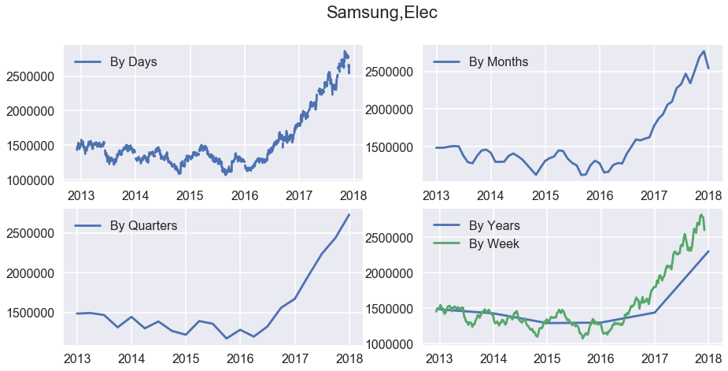
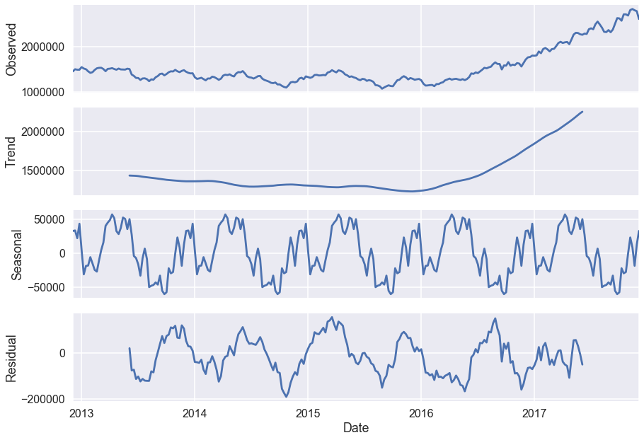
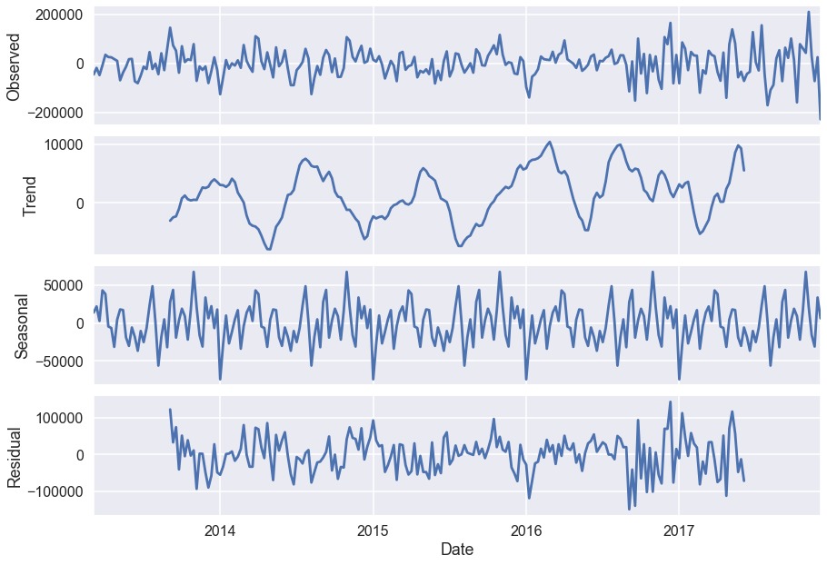
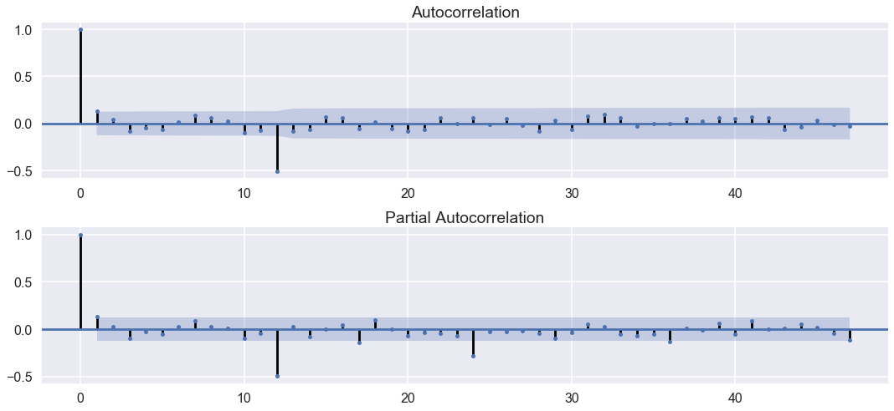
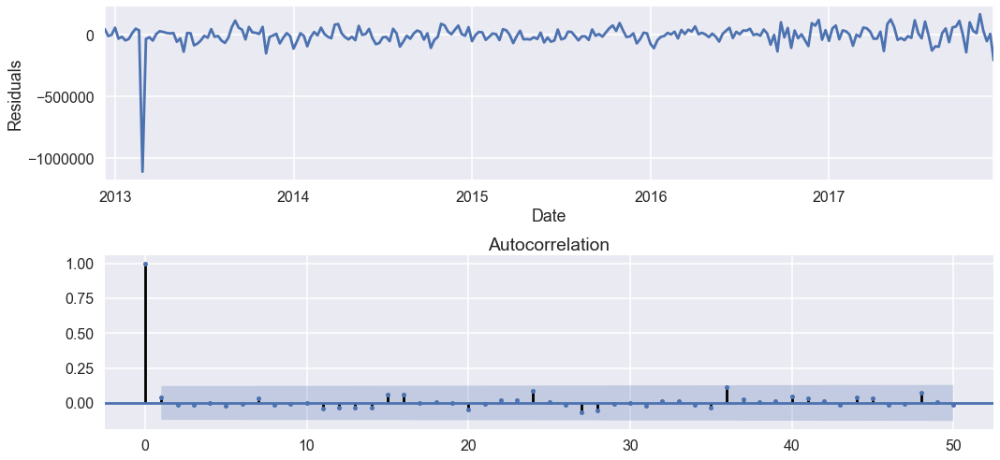
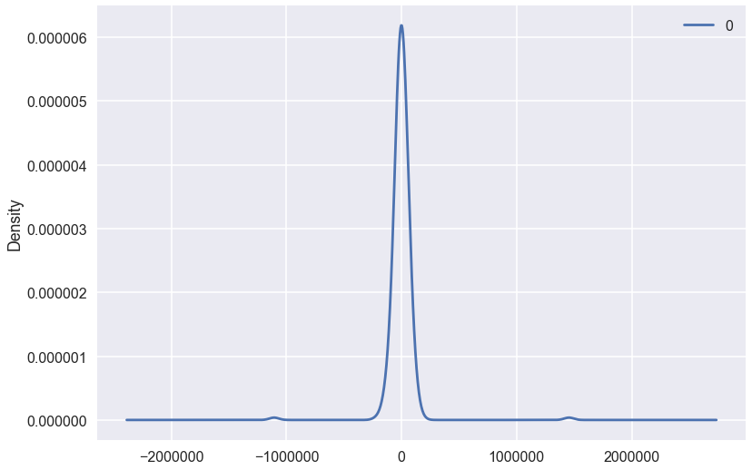
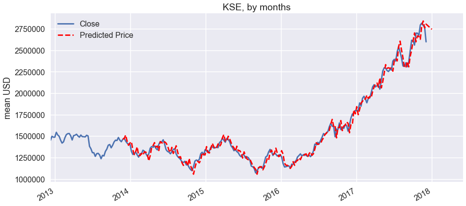

```python
# Import libraries
import numpy as np
import pandas as pd
import seaborn as sns
import matplotlib.pyplot as plt
import matplotlib as mpl
from scipy import stats
import statsmodels.api as sm
import warnings
from itertools import product
from datetime import datetime
warnings.filterwarnings('ignore')
plt.style.use('seaborn-poster')
```

    C:\ProgramData\Anaconda3\lib\site-packages\statsmodels\compat\pandas.py:56: FutureWarning: The pandas.core.datetools module is deprecated and will be removed in a future version. Please use the pandas.tseries module instead.
      from pandas.core import datetools


```python
# Load data
df = pd.read_csv('./samsungelec.csv')
df.head()
```


<div>
<style>
    .dataframe thead tr:only-child th {
        text-align: right;
    }

    .dataframe thead th {
        text-align: left;
    }

    .dataframe tbody tr th {
        vertical-align: top;
    }
</style>
<table border="1" class="dataframe">
  <thead>
    <tr style="text-align: right;">
      <th></th>
      <th>Date</th>
      <th>Open</th>
      <th>High</th>
      <th>Low</th>
      <th>Close</th>
      <th>Adj Close</th>
      <th>Volume</th>
    </tr>
  </thead>
  <tbody>
    <tr>
      <th>0</th>
      <td>2012-12-04</td>
      <td>1432000.0</td>
      <td>1434000.0</td>
      <td>1420000.0</td>
      <td>1430000.0</td>
      <td>1330524.375</td>
      <td>190098</td>
    </tr>
    <tr>
      <th>1</th>
      <td>2012-12-05</td>
      <td>1430000.0</td>
      <td>1455000.0</td>
      <td>1427000.0</td>
      <td>1455000.0</td>
      <td>1353785.375</td>
      <td>248728</td>
    </tr>
    <tr>
      <th>2</th>
      <td>2012-12-06</td>
      <td>1468000.0</td>
      <td>1471000.0</td>
      <td>1434000.0</td>
      <td>1454000.0</td>
      <td>1352855.000</td>
      <td>284974</td>
    </tr>
    <tr>
      <th>3</th>
      <td>2012-12-07</td>
      <td>1450000.0</td>
      <td>1498000.0</td>
      <td>1450000.0</td>
      <td>1480000.0</td>
      <td>1377046.375</td>
      <td>317649</td>
    </tr>
    <tr>
      <th>4</th>
      <td>2012-12-10</td>
      <td>1506000.0</td>
      <td>1506000.0</td>
      <td>1485000.0</td>
      <td>1491000.0</td>
      <td>1387281.000</td>
      <td>261122</td>
    </tr>
  </tbody>
</table>
</div>


```python
# Unix-time to 
df.Timestamp = pd.to_datetime(df.Date)

# Resampling to daily frequency
df.index = df.Timestamp
df = df.resample('D').mean()

df_week = df.resample('W').mean()

# Resampling to monthly frequency
df_month = df.resample('M').mean()

# Resampling to annual frequency
df_year = df.resample('A-DEC').mean()

# Resampling to quarterly frequency
df_Q = df.resample('Q-DEC').mean()
```


```python
fig = plt.figure(figsize=[15, 7])
plt.suptitle('Samsung,Elec', fontsize=22)

plt.subplot(221)
plt.plot(df.Close, '-', label='By Days')
plt.legend()

plt.subplot(222)
plt.plot(df_month.Close, '-', label='By Months')
plt.legend()

plt.subplot(223)
plt.plot(df_Q.Close, '-', label='By Quarters')
plt.legend()

plt.subplot(224)
plt.plot(df_year.Close, '-', label='By Years')
plt.legend()


plt.plot(df_week.Close, '-', label='By Week')
plt.legend()
# plt.tight_layout()
plt.show()
```





```python
plt.figure(figsize=[15,7])
sm.tsa.seasonal_decompose(df_week.Close).plot()
print("Dickey–Fuller test: p=%f" % sm.tsa.stattools.adfuller(df_week.Close)[1])
plt.show()
print(df_week.Close)
```

    Dickey–Fuller test: p=0.990576


    <matplotlib.figure.Figure at 0x1b0b846ae80>





    Date
    2012-12-09    1454750.0
    2012-12-16    1501000.0
    2012-12-23    1490750.0
    2012-12-30    1490500.0
    2013-01-06    1548000.0
    2013-01-13    1516600.0
    2013-01-20    1501000.0
    2013-01-27    1455400.0
    2013-02-03    1422000.0
    2013-02-10    1436200.0
    2013-02-17    1485750.0
    2013-02-24    1521400.0
    2013-03-03    1532000.0
    2013-03-10    1533600.0
    2013-03-17    1505800.0
    2013-03-24    1458400.0
    2013-03-31    1509000.0
    2013-04-07    1513800.0
    2013-04-14    1525200.0
    2013-04-21    1505400.0
    2013-04-28    1490400.0
    2013-05-05    1516000.0
    2013-05-12    1497200.0
    2013-05-19    1496250.0
    2013-05-26    1493600.0
    2013-06-02    1513400.0
    2013-06-09    1505000.0
    2013-06-16    1385000.0
    2013-06-23    1355200.0
    2013-06-30    1310400.0
                    ...    
    2017-05-14    2299250.0
    2017-05-21    2294800.0
    2017-05-28    2266600.0
    2017-06-04    2256000.0
    2017-06-11    2281250.0
    2017-06-18    2274000.0
    2017-06-25    2377600.0
    2017-07-02    2397600.0
    2017-07-09    2377200.0
    2017-07-16    2485800.0
    2017-07-23    2545000.0
    2017-07-30    2482600.0
    2017-08-06    2412800.0
    2017-08-13    2321000.0
    2017-08-20    2314250.0
    2017-08-27    2358600.0
    2017-09-03    2311800.0
    2017-09-10    2370000.0
    2017-09-17    2497200.0
    2017-09-24    2620250.0
    2017-10-01    2614600.0
    2017-10-08    2564000.0
    2017-10-15    2703000.0
    2017-10-22    2703000.0
    2017-10-29    2677200.0
    2017-11-05    2797800.0
    2017-11-12    2819800.0
    2017-11-19    2792400.0
    2017-11-26    2772000.0
    2017-12-03    2601600.0
    Freq: W-SUN, Name: Close, Length: 261, dtype: float64


```python
df_week['prices_box_diff'] = df_week.Close - df_week.Close.shift(12)

print("Dickey–Fuller test: p=%f" % sm.tsa.stattools.adfuller(df_week.prices_box_diff[12:])[1])
print(df_week['prices_box_diff'])
```

    Dickey–Fuller test: p=0.173805
    Date
    2012-12-09         NaN
    2012-12-16         NaN
    2012-12-23         NaN
    2012-12-30         NaN
    2013-01-06         NaN
    2013-01-13         NaN
    2013-01-20         NaN
    2013-01-27         NaN
    2013-02-03         NaN
    2013-02-10         NaN
    2013-02-17         NaN
    2013-02-24         NaN
    2013-03-03     77250.0
    2013-03-10     32600.0
    2013-03-17     15050.0
    2013-03-24    -32100.0
    2013-03-31    -39000.0
    2013-04-07     -2800.0
    2013-04-14     24200.0
    2013-04-21     50000.0
    2013-04-28     68400.0
    2013-05-05     79800.0
    2013-05-12     11450.0
    2013-05-19    -25150.0
    2013-05-26    -38400.0
    2013-06-02    -20200.0
    2013-06-09      -800.0
    2013-06-16    -73400.0
    2013-06-23   -153800.0
    2013-06-30   -203400.0
                    ...   
    2017-05-14    407850.0
    2017-05-21    351800.0
    2017-05-28    318600.0
    2017-06-04    247400.0
    2017-06-11    205250.0
    2017-06-18    171800.0
    2017-06-25    301200.0
    2017-07-02    306600.0
    2017-07-09    278400.0
    2017-07-16    435800.0
    2017-07-23    393000.0
    2017-07-30    222100.0
    2017-08-06    113550.0
    2017-08-13     26200.0
    2017-08-20     47650.0
    2017-08-27    102600.0
    2017-09-03     30550.0
    2017-09-10     96000.0
    2017-09-17    119600.0
    2017-09-24    222650.0
    2017-10-01    237400.0
    2017-10-08     78200.0
    2017-10-15    158000.0
    2017-10-22    220400.0
    2017-10-29    264400.0
    2017-11-05    476800.0
    2017-11-12    505550.0
    2017-11-19    433800.0
    2017-11-26    460200.0
    2017-12-03    231600.0
    Freq: W-SUN, Name: prices_box_diff, Length: 261, dtype: float64


```python
# Regular differentiation
df_week['prices_box_diff2'] = df_week.prices_box_diff - df_week.prices_box_diff.shift(1)
plt.figure(figsize=(15,7))

# STL-decomposition
sm.tsa.seasonal_decompose(df_week.prices_box_diff2[13:]).plot()   
print("Dickey–Fuller test: p=%f" % sm.tsa.stattools.adfuller(df_week.prices_box_diff2[13:])[1])


plt.show()

print(df_week['prices_box_diff2'])


```

    Dickey–Fuller test: p=0.000000


    <matplotlib.figure.Figure at 0x1b0b6e98e10>





    Date
    2012-12-09         NaN
    2012-12-16         NaN
    2012-12-23         NaN
    2012-12-30         NaN
    2013-01-06         NaN
    2013-01-13         NaN
    2013-01-20         NaN
    2013-01-27         NaN
    2013-02-03         NaN
    2013-02-10         NaN
    2013-02-17         NaN
    2013-02-24         NaN
    2013-03-03         NaN
    2013-03-10    -44650.0
    2013-03-17    -17550.0
    2013-03-24    -47150.0
    2013-03-31     -6900.0
    2013-04-07     36200.0
    2013-04-14     27000.0
    2013-04-21     25800.0
    2013-04-28     18400.0
    2013-05-05     11400.0
    2013-05-12    -68350.0
    2013-05-19    -36600.0
    2013-05-26    -13250.0
    2013-06-02     18200.0
    2013-06-09     19400.0
    2013-06-16    -72600.0
    2013-06-23    -80400.0
    2013-06-30    -49600.0
                    ...   
    2017-05-14     82750.0
    2017-05-21    -56050.0
    2017-05-28    -33200.0
    2017-06-04    -71200.0
    2017-06-11    -42150.0
    2017-06-18    -33450.0
    2017-06-25    129400.0
    2017-07-02      5400.0
    2017-07-09    -28200.0
    2017-07-16    157400.0
    2017-07-23    -42800.0
    2017-07-30   -170900.0
    2017-08-06   -108550.0
    2017-08-13    -87350.0
    2017-08-20     21450.0
    2017-08-27     54950.0
    2017-09-03    -72050.0
    2017-09-10     65450.0
    2017-09-17     23600.0
    2017-09-24    103050.0
    2017-10-01     14750.0
    2017-10-08   -159200.0
    2017-10-15     79800.0
    2017-10-22     62400.0
    2017-10-29     44000.0
    2017-11-05    212400.0
    2017-11-12     28750.0
    2017-11-19    -71750.0
    2017-11-26     26400.0
    2017-12-03   -228600.0
    Freq: W-SUN, Name: prices_box_diff2, Length: 261, dtype: float64


```python
# Initial approximation of parameters using Autocorrelation and Partial Autocorrelation Plots
plt.figure(figsize=(15,7))
ax = plt.subplot(211)

sm.graphics.tsa.plot_acf(df_week.prices_box_diff2[13:].values.squeeze(), lags=47, ax=ax)

ax = plt.subplot(212)

sm.graphics.tsa.plot_pacf(df_week.prices_box_diff2[13:].values.squeeze(), lags=47, ax=ax)


plt.tight_layout()
plt.show()
```





```python
# Initial approximation of parameters
Qs = range(0, 2)
qs = range(0, 6)
Ps = range(0, 3)
ps = range(0, 6)
D=1
d=1
parameters = product(ps, qs, Ps, Qs)
parameters_list = list(parameters)
len(parameters_list)

# Model Selection
results = []
best_aic = float("inf")
warnings.filterwarnings('ignore')
for param in parameters_list:
    try:
        model=sm.tsa.statespace.SARIMAX(df_week.Close, order=(param[0], d, param[1]), 
                                        seasonal_order=(param[2], D, param[3], 12)).fit(disp=-1)
    except ValueError:
        print('wrong parameters:', param)
        continue
    aic = model.aic
    if aic < best_aic:
        best_model = model
        best_aic = aic
        best_param = param
    results.append([param, model.aic])
```

    wrong parameters: (0, 0, 0, 0)
    wrong parameters: (2, 1, 0, 0)
    wrong parameters: (2, 1, 0, 1)
    wrong parameters: (2, 1, 1, 0)
    wrong parameters: (2, 1, 1, 1)
    wrong parameters: (2, 1, 2, 0)
    wrong parameters: (2, 1, 2, 1)
    wrong parameters: (2, 4, 0, 0)
    wrong parameters: (2, 4, 0, 1)
    wrong parameters: (2, 4, 1, 0)
    wrong parameters: (2, 4, 1, 1)


    ---------------------------------------------------------------------------

    LinAlgError                               Traceback (most recent call last)

    <ipython-input-41-c23d2bd11b2c> in <module>()
         17     try:
         18         model=sm.tsa.statespace.SARIMAX(df_week.Close, order=(param[0], d, param[1]), 
    ---> 19                                         seasonal_order=(param[2], D, param[3], 12)).fit(disp=-1)
         20     except ValueError:
         21         print('wrong parameters:', param)


    C:\ProgramData\Anaconda3\lib\site-packages\statsmodels\tsa\statespace\mlemodel.py in fit(self, start_params, transformed, cov_type, cov_kwds, method, maxiter, full_output, disp, callback, return_params, optim_score, optim_complex_step, optim_hessian, **kwargs)
        444                                            full_output=full_output,
        445                                            disp=disp, callback=callback,
    --> 446                                            skip_hessian=True, **kwargs)
        447 
        448         # Just return the fitted parameters if requested


    C:\ProgramData\Anaconda3\lib\site-packages\statsmodels\base\model.py in fit(self, start_params, method, maxiter, full_output, disp, fargs, callback, retall, skip_hessian, **kwargs)
        449                                                        callback=callback,
        450                                                        retall=retall,
    --> 451                                                        full_output=full_output)
        452 
        453         #NOTE: this is for fit_regularized and should be generalized


    C:\ProgramData\Anaconda3\lib\site-packages\statsmodels\base\optimizer.py in _fit(self, objective, gradient, start_params, fargs, kwargs, hessian, method, maxiter, full_output, disp, callback, retall)
        182                             disp=disp, maxiter=maxiter, callback=callback,
        183                             retall=retall, full_output=full_output,
    --> 184                             hess=hessian)
        185 
        186         optim_settings = {'optimizer': method, 'start_params': start_params,


    C:\ProgramData\Anaconda3\lib\site-packages\statsmodels\base\optimizer.py in _fit_lbfgs(f, score, start_params, fargs, kwargs, disp, maxiter, callback, retall, full_output, hess)
        376                                          callback=callback, args=fargs,
        377                                          bounds=bounds, disp=disp,
    --> 378                                          **extra_kwargs)
        379 
        380     if full_output:


    C:\ProgramData\Anaconda3\lib\site-packages\scipy\optimize\lbfgsb.py in fmin_l_bfgs_b(func, x0, fprime, args, approx_grad, bounds, m, factr, pgtol, epsilon, iprint, maxfun, maxiter, disp, callback, maxls)
        191 
        192     res = _minimize_lbfgsb(fun, x0, args=args, jac=jac, bounds=bounds,
    --> 193                            **opts)
        194     d = {'grad': res['jac'],
        195          'task': res['message'],


    C:\ProgramData\Anaconda3\lib\site-packages\scipy\optimize\lbfgsb.py in _minimize_lbfgsb(fun, x0, args, jac, bounds, disp, maxcor, ftol, gtol, eps, maxfun, maxiter, iprint, callback, maxls, **unknown_options)
        326             # until the completion of the current minimization iteration.
        327             # Overwrite f and g:
    --> 328             f, g = func_and_grad(x)
        329         elif task_str.startswith(b'NEW_X'):
        330             # new iteration


    C:\ProgramData\Anaconda3\lib\site-packages\scipy\optimize\lbfgsb.py in func_and_grad(x)
        271     if jac is None:
        272         def func_and_grad(x):
    --> 273             f = fun(x, *args)
        274             g = _approx_fprime_helper(x, fun, epsilon, args=args, f0=f)
        275             return f, g


    C:\ProgramData\Anaconda3\lib\site-packages\scipy\optimize\optimize.py in function_wrapper(*wrapper_args)
        290     def function_wrapper(*wrapper_args):
        291         ncalls[0] += 1
    --> 292         return function(*(wrapper_args + args))
        293 
        294     return ncalls, function_wrapper


    C:\ProgramData\Anaconda3\lib\site-packages\statsmodels\base\model.py in <lambda>(params, *args)
        427 
        428         nobs = self.endog.shape[0]
    --> 429         f = lambda params, *args: -self.loglike(params, *args) / nobs
        430         score = lambda params, *args: -self.score(params, *args) / nobs
        431         try:


    C:\ProgramData\Anaconda3\lib\site-packages\statsmodels\tsa\statespace\mlemodel.py in loglike(self, params, *args, **kwargs)
        635             params = self.transform_params(params)
        636 
    --> 637         self.update(params, transformed=True, complex_step=complex_step)
        638 
        639         if complex_step:


    C:\ProgramData\Anaconda3\lib\site-packages\statsmodels\tsa\statespace\sarimax.py in update(self, params, transformed, complex_step)
       1664         # Initialize
       1665         if not self._manual_initialization:
    -> 1666             self.initialize_state(complex_step=complex_step)
       1667 
       1668         return params


    C:\ProgramData\Anaconda3\lib\site-packages\statsmodels\tsa\statespace\sarimax.py in initialize_state(self, variance, complex_step)
        727                 self.ssm.transition[start:end, start:end, 0],
        728                 selected_state_cov_stationary,
    --> 729                 complex_step=complex_step
        730             )
        731 


    C:\ProgramData\Anaconda3\lib\site-packages\statsmodels\tsa\statespace\tools.py in solve_discrete_lyapunov(a, q, complex_step)
        327     else:
        328         aH = a.transpose()
    --> 329         aHI_inv = np.linalg.inv(aH + eye)
        330         b = np.dot(aH - eye, aHI_inv)
        331         c = 2*np.dot(np.dot(np.linalg.inv(a + eye), q), aHI_inv)


    C:\ProgramData\Anaconda3\lib\site-packages\numpy\linalg\linalg.py in inv(a)
        524     signature = 'D->D' if isComplexType(t) else 'd->d'
        525     extobj = get_linalg_error_extobj(_raise_linalgerror_singular)
    --> 526     ainv = _umath_linalg.inv(a, signature=signature, extobj=extobj)
        527     return wrap(ainv.astype(result_t, copy=False))
        528 


    C:\ProgramData\Anaconda3\lib\site-packages\numpy\linalg\linalg.py in _raise_linalgerror_singular(err, flag)
         88 
         89 def _raise_linalgerror_singular(err, flag):
    ---> 90     raise LinAlgError("Singular matrix")
         91 
         92 def _raise_linalgerror_nonposdef(err, flag):


    LinAlgError: Singular matrix


```python
result_table = pd.DataFrame(results)
result_table.columns = ['parameters', 'aic']
print(result_table.sort_values(by = 'aic', ascending=True).head())
print(best_model.summary())
```

          parameters          aic
    2   (0, 0, 1, 1)  6121.127071
    38  (1, 0, 1, 1)  6123.391195
    8   (0, 1, 1, 1)  6124.026378
    4   (0, 0, 2, 1)  6124.160288
    40  (1, 0, 2, 1)  6124.953946
                                     Statespace Model Results                                 
    ==========================================================================================
    Dep. Variable:                              Close   No. Observations:                  261
    Model:             SARIMAX(0, 1, 0)x(1, 1, 1, 12)   Log Likelihood               -3057.564
    Date:                            Tue, 05 Dec 2017   AIC                           6121.127
    Time:                                    11:34:11   BIC                           6131.821
    Sample:                                12-09-2012   HQIC                          6125.426
                                         - 12-03-2017                                         
    Covariance Type:                              opg                                         
    ==============================================================================
                     coef    std err          z      P>|z|      [0.025      0.975]
    ------------------------------------------------------------------------------
    ar.S.L12       0.5370      0.027     20.005      0.000       0.484       0.590
    ma.S.L12      -1.0000      0.063    -15.753      0.000      -1.124      -0.876
    sigma2      2.368e+09   2.68e-11   8.83e+19      0.000    2.37e+09    2.37e+09
    ===================================================================================
    Ljung-Box (Q):                       58.83   Jarque-Bera (JB):                12.18
    Prob(Q):                              0.03   Prob(JB):                         0.00
    Heteroskedasticity (H):               2.06   Skew:                            -0.23
    Prob(H) (two-sided):                  0.00   Kurtosis:                         3.98
    ===================================================================================
    
    Warnings:
    [1] Covariance matrix calculated using the outer product of gradients (complex-step).
    [2] Covariance matrix is singular or near-singular, with condition number 3.65e+35. Standard errors may be unstable.


```python
# STL-decomposition
plt.figure(figsize=(15,7))
plt.subplot(211)
best_model.resid[1:].plot()
plt.ylabel(u'Residuals')
ax = plt.subplot(212)
sm.graphics.tsa.plot_acf(best_model.resid[1:].values.squeeze(), lags=50, ax=ax)

print("Dickey–Fuller test:: p=%f" % sm.tsa.stattools.adfuller(best_model.resid[1:])[1])

plt.tight_layout()
plt.show()
```

    Dickey–Fuller test:: p=0.000000





```python
from pandas import DataFrame

residuals = DataFrame(best_model.resid)
residuals.plot(kind='kde')
print(residuals.describe())
plt.show()
```

                      0
    count  2.610000e+02
    mean  -4.457853e+02
    std    1.253184e+05
    min   -1.107088e+06
    25%   -3.393280e+04
    50%    4.848434e+02
    75%    3.215804e+04
    max    1.454750e+06





```python
# Prediction
df_month2 = df_week[['Close']]
date_list = [ datetime(2017, 12, 31),
             datetime(2018, 1, 1),
             datetime(2018, 1, 10),
             datetime(2018, 1, 20),
             datetime(2018, 1, 31),
                 datetime(2018, 2, 28),
             datetime(2018, 3, 31),
             datetime(2018, 4, 30),
             datetime(2018, 5, 30)                          
            ]
future = pd.DataFrame(index=date_list, columns= df_week.columns)
df_month2 = pd.concat([df_month2, future])
df_month2['forecast'] = best_model.predict(start=50, end=500)
plt.figure(figsize=(15,7))
df_month2.Close.plot()
df_month2.forecast.plot(color='r', ls='--', label='Predicted Price')
plt.legend()
plt.title('KSE, by months')
plt.ylabel('mean USD')
plt.show()
```




